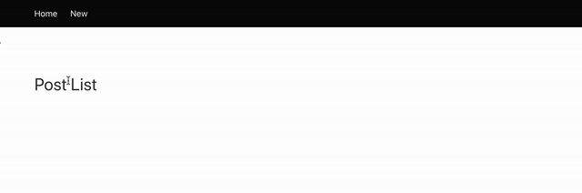

# Django_Bulma_Message_Framework

[referred blog](https://narito.ninja/blog/detail/120/)



> ## models.py
``` python
from django.db import models

class Post(models.Model):
    title = models.CharField('title', max_length=255)

    def __str__(self):
        return self.title
```

> ## admin.py
``` python
from django.contrib import admin
from .models import Post

admin.site.register(Post)
```

> ## views.py
``` python
from django.contrib import messages
from django.shortcuts import redirect
from django.urls import reverse_lazy
from django.views import generic
from .models import Post


class PostList(generic.ListView):
    model = Post


class PostCreate(generic.CreateView):
    model = Post
    fields = '__all__'
    success_url = reverse_lazy('app:post_list')

    def form_valid(self, form):
        self.object = post = form.save()
        messages.info(self.request, f'New post was created! Title:{post.title} pk:{post.pk}')
        return redirect(self.get_success_url())


class PostUpdate(generic.UpdateView):
    model = Post
    fields = '__all__'
    success_url = reverse_lazy('app:post_list')

    def form_valid(self, form):
        self.object = post = form.save()
        messages.info(self.request, f'Successfully edited! Title:{post.title} pk:{post.pk}')
        return redirect(self.get_success_url())


class PostDelete(generic.DeleteView):
    model = Post
    success_url = reverse_lazy('app:post_list')

    def delete(self, request, *args, **kwargs):
        self.object = post = self.get_object()
        message = f'Successfully deleted! Title:{post.title} pk:{post.pk}'
        post.delete()
        messages.info(self.request, message)
        return redirect(self.get_success_url())
```

> ## urls.py
``` python
from django.urls import path
from . import views

app_name = 'app'

urlpatterns = [
    path('', views.PostList.as_view(), name='post_list'),
    path('create/', views.PostCreate.as_view(), name='post_create'),
    path('update/<int:pk>/', views.PostUpdate.as_view(), name='post_update'),
    path('delete/<int:pk>/', views.PostDelete.as_view(), name='post_delete')
]
```

> ## profile_list.html
``` python

```
